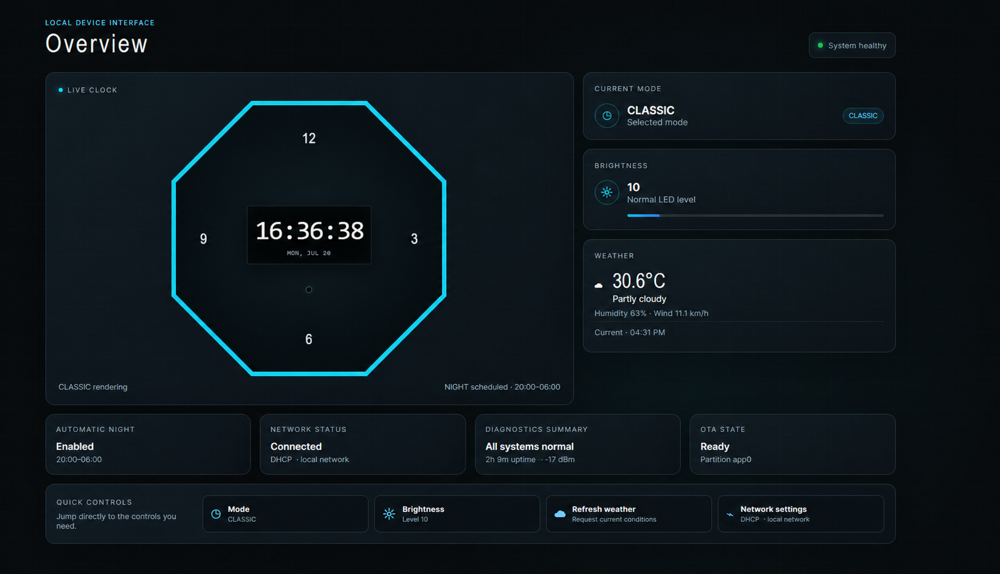
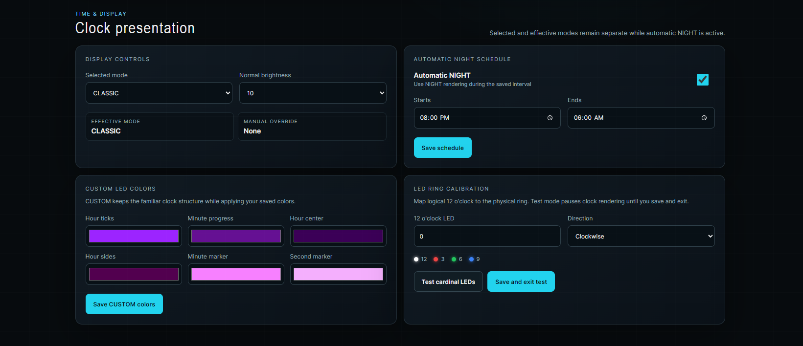
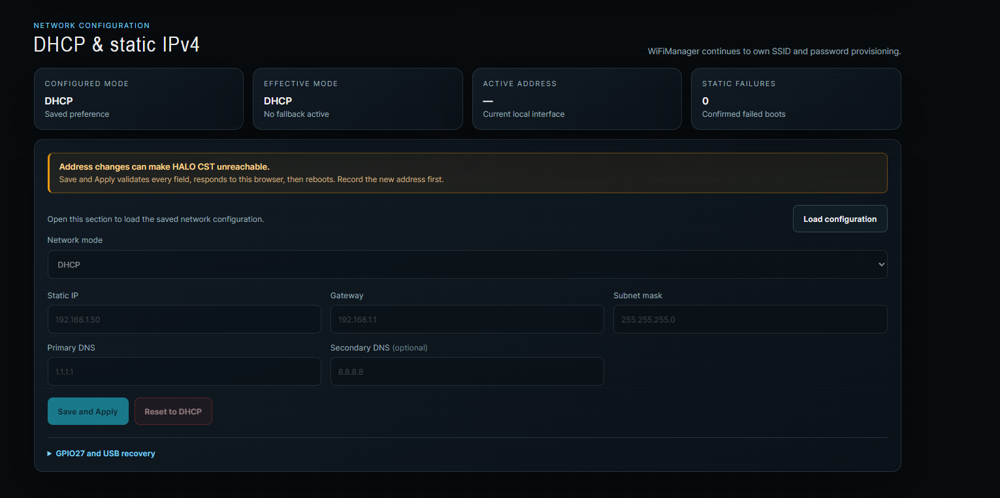
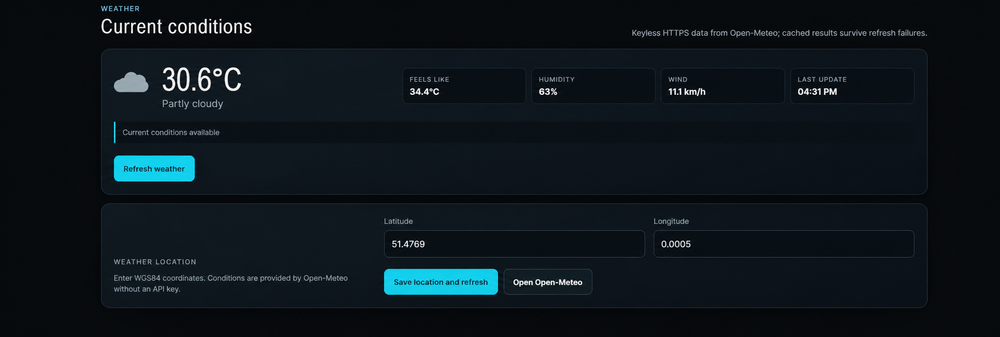
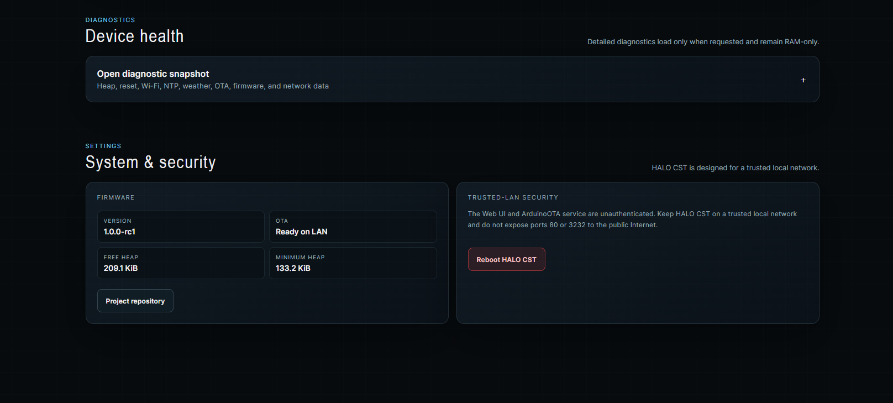
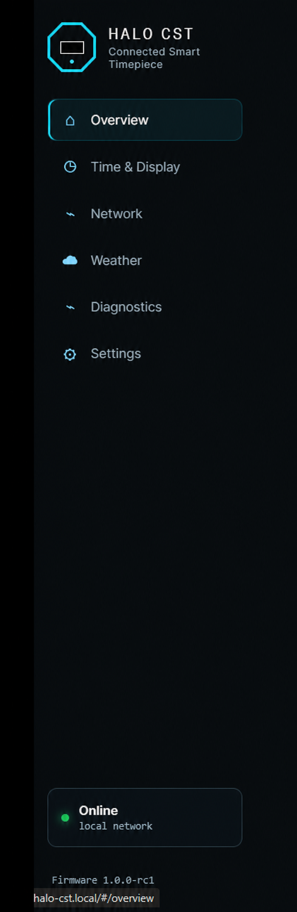

# HALO CST

<p align="center">
  
</p>

<p align="center">
  An ESP32-based connected clock with a 60-pixel LED display, centered OLED, local controls, weather, OTA updates, and a responsive embedded Web UI.
</p>

<p align="center">
  <a href="https://github.com/Zivchaos/Halo_Clock/actions/workflows/platformio.yml"></a>
  <a href="LICENSE"></a>
  
  
</p>

> **Prototype status:** HALO CST is a working maker prototype. Its firmware and local Web UI are actively documented; the physical enclosure is not a finalized production design.

## What is HALO CST?

HALO CST — Connected Smart Timepiece — is a local-first ESP32 clock. A 60-pixel WS2812B ring communicates time at a glance, while a centered SH1106 OLED presents precise time, temporary weather, and service notices.

The clock continues operating when optional network services are unavailable. Wi-Fi adds NTP synchronization, Open-Meteo current conditions, a browser-based local dashboard, and ArduinoOTA updates.

## Highlights

- ESP32 clock with a 60-pixel WS2812B ring and 128 × 64 SH1106 OLED
- CLASSIC, MINIMAL, NIGHT, and CUSTOM display modes
- Automatic NIGHT scheduling with manual override
- Persistent brightness, display, schedule, color, weather-location, and ring-calibration settings
- Configurable ring direction and physical 12 o’clock LED offset
- Responsive, local-only Web UI with status, controls, diagnostics, and network configuration
- Cached Open-Meteo current conditions with safe backoff and stale-state reporting
- DHCP and validated static IPv4 configuration with physical recovery guidance
- ArduinoOTA with OLED and LED progress feedback
- Embedded generated Web UI assets; no runtime web dependencies

## Web Interface

Open `http://halo-cst.local` from the same trusted LAN.

The dashboard follows the physical timepiece’s visual language: an octagonal clock silhouette, a centered OLED motif, near-black instrument surfaces, and a restrained cyan perimeter glow. It provides:

- Live time, selected/effective display mode, brightness, weather, network, OTA, and diagnostics state
- Display mode, brightness, automatic NIGHT, CUSTOM-color, and ring-calibration controls
- Persisted weather location
- DHCP/static IPv4 configuration and recovery guidance
- On-demand diagnostics copy/download and confirmed reboot controls

Editable Web UI files live in [`webui/`](webui/). Rebuild the embedded asset bundle after editing them:

```sh
python tools/build-web-assets.py
```

Read the full [Web UI design guide](docs/WEB_UI_DESIGN.md).

## Hardware Prototype

HALO CST currently targets:

- ESP32-WROOM DevKit or compatible `esp32dev` board with 4 MiB flash
- 60-pixel WS2812B-compatible LED ring or strip
- 128 × 64 SH1106 I²C OLED, normally at `0x3C`
- Momentary button on GPIO27
- Regulated 5 V LED power supply

| Function | ESP32 pin |
| --- | --- |
| WS2812B data | GPIO18 |
| Button | GPIO27 |
| OLED SDA | GPIO21 |
| OLED SCL | GPIO22 |

For LED power, grounding, logic-level, and calibration guidance, see [the wiring guide](docs/WIRING.md).

## Screenshots

### Live overview



### Display and calibration



### Network, weather, and diagnostics

| Network configuration | Weather | Diagnostics and settings |
| --- | --- | --- |
|  |  |  |

The desktop interface uses a persistent navigation rail:

<p align="center">
  
</p>

## Quick Start

1. Install PlatformIO Core or VS Code with the PlatformIO extension.
2. Connect the ESP32 with a data-capable USB cable.
3. Build and upload:

   ```sh
   pio run --target upload --upload-port <serial-port>
   ```

4. On first boot, join the `HALO-CST-Setup` access point if provisioning is required.
5. Complete Wi-Fi setup, then open `http://halo-cst.local`.

The setup portal is intentionally open; complete provisioning only on a trusted network.

## Building the Firmware

```sh
pio run
pio run -e esp32dev_ota
```

The project uses a custom 4 MiB dual-OTA partition layout. The first migration from a different layout must be installed over USB, not OTA. See [partition migration guidance](docs/PARTITION_MIGRATION.md).

## Web UI Development

Source files:

```text
webui/index.html
webui/styles.css
webui/app.js
```

Generate the flash-resident bundle:

```sh
python tools/build-web-assets.py
```

Run source-level Web UI checks:

```powershell
powershell -ExecutionPolicy Bypass -File tools/test-webui-redesign.ps1 -SourceOnly
```

## Configuration

Fresh-install defaults are centralized in [`include/Config.h`](include/Config.h), including timezone, automatic NIGHT scheduling, weather coordinates, LED brightness levels, ring direction/offset, and weather refresh behavior.

Persistent application settings intentionally remain in the ESP32 Preferences namespace `halo-clock` for upgrade compatibility.

## Project Structure

```text
include/                 Hardware, behavior, and product metadata
src/                     Firmware services and rendering code
webui/                   Editable Web UI HTML, CSS, and JavaScript
assets/branding/         HALO CST source SVG marks and brand guide
docs/                    Architecture, UI, wiring, network, and migration docs
test/                    PlatformIO tests
tools/                   Build, API, soak, and release-check scripts
.github/                 CI, issue forms, and pull-request template
```

## Testing

The repository includes PlatformIO weather-parser, diagnostics, and network-configuration tests; Web UI source, API, and soak tests; public-release consistency checks; and a GitHub Actions firmware build. CI compiles embedded test targets only—it never uploads test firmware.

```sh
pio test -e weather_tests --upload-port <dedicated-test-port> --test-port <dedicated-test-port>
pio test -e diagnostics_tests --upload-port <dedicated-test-port> --test-port <dedicated-test-port>
pio test -e network_tests --upload-port <dedicated-test-port> --test-port <dedicated-test-port>
```

```powershell
powershell -ExecutionPolicy Bypass -File tools/test-public-release.ps1
```

Never run embedded tests against a production clock: they upload test firmware. To reproduce CI's safe compile-only validation, add `--without-uploading --without-testing`.

## Roadmap

- Expand post-release hardware and rendering coverage
- Expand automated hardware and rendering coverage
- Document approved prototype enclosures and face designs
- Evaluate authenticated management while preserving local-first operation

Cloud telemetry, forecasts, and remote dashboards are intentionally outside the current scope.

## Releases

Current firmware: **1.0.0**. Milestone history is recorded in [CHANGELOG.md](CHANGELOG.md); prototype and release tags preserve historical firmware states.

## Red Alert credits

The Israeli Red Alert companion add-on was inspired by and researched with
these community projects:

- [dmatik/oref-alerts-proxy-ms](https://github.com/dmatik/oref-alerts-proxy-ms)
- [moshepinhasi/Red_alert_monitor](https://github.com/moshepinhasi/Red_alert_monitor)

HALO CST uses this feature only as a visual aid. Official Home Front Command
alerts and instructions remain the primary alert channels.

## Security

HALO CST is designed for a trusted local network. The Web UI has local-network controls protected against cross-site requests. ArduinoOTA is disabled by default and requires an administrator password before it can be enabled for the current session. Do not expose ports 80 or 3232 to the public Internet.

Outbound weather and the default Red Alert relay use certificate validation. A custom relay must present a certificate that chains to one of the firmware's trusted provider roots, otherwise HALO will reject it.

Read [SECURITY.md](SECURITY.md) before deploying or reporting a vulnerability.

## License

HALO CST is available under the [MIT License](LICENSE).

Contributions are welcome. Please read [CONTRIBUTING.md](CONTRIBUTING.md) and the [Code of Conduct](CODE_OF_CONDUCT.md).
