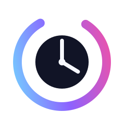

# HALO Clock



**HALO is an elegant, connected timepiece built for makers who appreciate thoughtful design, clean engineering, and beautiful light.**

HALO combines a 60-pixel WS2812B clock face with a central 128×64 SH1106 OLED. It synchronizes time over Wi-Fi, shows local weather, stores its configuration in flash, and exposes a responsive dashboard at `http://halo-clock.local`.

## Current firmware

Version `0.5.0-beta` includes:

- WiFiManager captive setup portal with automatic reconnect
- NTP time with configurable POSIX timezone and DST
- Five LED display modes and six color themes
- Configurable 1-, 3-, or 5-pixel hour marker
- Automatic day/night brightness
- Gamma correction and a 650 mA LED current limiter
- Smooth seconds trail, minute progress, ticks, orientation, and direction controls
- Rotating clock, weather, network, and system OLED pages
- Non-blocking queued OLED notifications
- Open-Meteo current weather (no API key)
- Persistent settings using ESP32 Preferences
- Mobile web dashboard and browser firmware updates
- One-button page, theme, mode, and Wi-Fi setup controls
- mDNS address: `halo-clock.local`

## Hardware

| Component | Connection |
|---|---|
| WS2812B DIN | GPIO18 through a 330 Ω series resistor |
| WS2812B power | 5V and GND |
| SH1106 SDA | GPIO21 |
| SH1106 SCL | GPIO22 |
| SH1106 power | 3.3V and GND |
| Push button | GPIO27 to GND |

Add a 500–1000 µF electrolytic capacitor across the LED strip's 5V and GND input. All devices must share ground. See [the wiring guide](docs/WIRING.md) before soldering.

## Build and flash

1. Install [Visual Studio Code](https://code.visualstudio.com/) and PlatformIO.
2. Open this repository as a PlatformIO project.
3. Connect the ESP32-WROOM DevKit over USB.
4. Run **PlatformIO: Build**, then **PlatformIO: Upload**.
5. Open the serial monitor at 115200 baud.

The first `0.5.0-beta` installation must use USB because this release installs an OTA-capable partition table. Later releases can use the browser updater.

Command-line equivalent:

```powershell
platformio run --project-conf platformIO.ini
platformio run --project-conf platformIO.ini --target upload
platformio device monitor --baud 115200
```

The dashboard is embedded in the firmware; no LittleFS upload is required.

## First-time setup

When HALO has no saved Wi-Fi network, it creates:

- Network: `HALO Clock Setup`
- Password: `halo-clock`
- Portal: `http://192.168.4.1`

After joining the setup network, choose the home Wi-Fi network. Once connected, open `http://halo-clock.local` to configure the clock.

## Button controls

| Gesture | Action |
|---|---|
| Short press | Next OLED page |
| Double press | Next color theme |
| Long press (1.2 s) | Next LED display mode |
| Very long press (5 s) | Start Wi-Fi setup portal |

## Dashboard

The embedded dashboard controls brightness, night schedule, theme, display mode, hour width, LED offset and direction, weather coordinates, timezone, firmware updates, restart, and Wi-Fi reset.

## Repository layout

```text
assets/       HALO logo and icon source files
docs/         Wiring, architecture, and product documentation
faceplates/   Firmware-independent printable faceplate SVGs
include/      Hardware, build, and shared type configuration
src/          Firmware services and device managers
platformIO.ini
```

## Faceplates

The firmware only needs the LED index located at 12 o'clock. Physical styling is independent. Starter faceplates are provided in `faceplates/`; use the dashboard's **12 o'clock LED offset** and **clockwise strip** controls to align any design without recompiling.

## Safety

Do not power a fully illuminated 60-pixel strip through an under-rated USB source or thin breadboard wiring. HALO limits estimated LED current in software, but the power wiring and supply still need to be appropriate.

## License

HALO Clock is released under the [MIT License](LICENSE).
